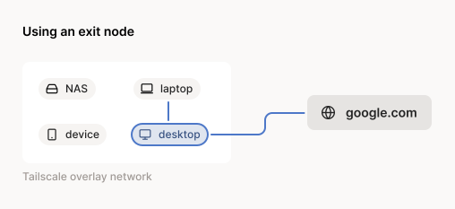

## Tailscale이란

Tailscale은 [WireGuard](https://www.wireguard.com/)를 기반으로 한 VPN 서비스입니다.

Tailscale은 기존의 일반적인 VPN과는 다르게 중앙이 되는 서버가 없습니다.
대신 각 노드들이 서로 연결되어 있는 분산형 네트워크를 구축합니다.

기존의 VPN이 아래 그럼과 같이 구성되어 있다면, Tailscale은 각각의 클라이언트들이 서로 연결되어 있는 구조입니다.


## Tailscale 설치하기

먼저 [Tailscale 홈페이지](https://tailscale.com/)에 접속하여 회원가입을 합니다.


회원가입을 완료하면, 아래와 같이 Tailscale을 설치할 수 있는 링크가 제공됩니다.


사용하는 운영체제에 맞는 설치 파일을 다운로드 받아 설치합니다.

## Tailscale 설정하기

Tailscale을 사용할 기기 모두 로그인을 하면, [Admin 콘솔](https://login.tailscale.com/admin/machines)에 아래와 같이 기기들이 연결되어 있는 것을 확인할 수 있습니다.

저기 나와있는 IP 주소들은 각 기기들의 Tailscale 내부 IP 주소입니다.

Tailscale 망으로 묶여있기 때문에, 이 IP 주소들을 이용하여 서로 통신할 수 있습니다.


### Tailscale을 이용하여 SSH 접속하기

Tailscale 망을 통한 SSH 접속도 잘 되는것을 확인할 수 있습니다.


## Subnet Router란

서브넷 라우터는 Tailscale을 이용하여 서로 다른 서브넷에 있는 기기들이 서로 통신할 수 있도록 해주는 기능입니다.

아래 사진처럼 Tailscale에 연결된 기기가 게이트웨이 역할을 하여 다른 서브넷(192.168.0.0/24)에 있는 기기들과 통신할 수 있도록 해줍니다.


아래 명령어는 리눅스 기기에서 서브넷 라우터를 활성화하는 명령어입니다.

여기서는 192.168.0.0/24 대역으로 설정하였습니다.

```sh
echo 'net.ipv4.ip_forward = 1' | sudo tee -a /etc/sysctl.conf
echo 'net.ipv6.conf.all.forwarding = 1' | sudo tee -a /etc/sysctl.conf
sudo sysctl -p /etc/sysctl.conf

sudo tailscale up --advertise-routes=192.168.0.0/24
```

Admin 콘솔에 들어가 노드 설정에서 Edit route settings를 클릭하여 라우팅을 허용해주면 됩니다.




이제 Tailscale에 연결된 상태로 192.168.0.0/24 대역에 접속을 하면 해당 노드를 통해 접속이 됩니다.

## Exit Node란

일반적인 VPN이라면 연결하는 순간 모든 트래픽이 VPN을 통해 나가게 되면서 공인 IP 또한 변경되게 됩니다.

하지만 Tailscale의 경우에는 Exit Node를 설정하지 않는다면 각 노드들의 통신만 Tailscale을 통해 이루어지게 됩니다.

외부의 공공 WiFi를 이용하거나, 공인 IP를 변경해야 하는 경우에 Exit Node를 사용해서 통신을 할 수 있습니다.

그림으로 설명하면 아래와 같습니다.





Exit Node를 설정하는 방법은 아래와 같습니다.

```sh
echo 'net.ipv4.ip_forward = 1' | sudo tee -a /etc/sysctl.conf
echo 'net.ipv6.conf.all.forwarding = 1' | sudo tee -a /etc/sysctl.conf
sudo sysctl -p /etc/sysctl.conf

sudo tailscale up --advertise-exit-node
```

그리고 서브넷 마스크 설정과 마찬가지로 Edit route settings를 클릭하여 라우팅을 허용해주면 됩니다.




이제 Exit Node를 통한 통신이 필요한 클라이언트에서 Exit Node를 사용하도록 설정하면 됩니다.


